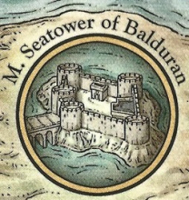

<html>

<b>Balduran's Sea Tower</b>

<b>Quest mod for BGEE/SoD or EET</b>

History: The massive Sea Tower of Balduran rested on a rocky island in the bay of Baldur's Gate. Named after Balduran, the tower could be reached by a bridge from the western shore linking it to the mainland. It was used as a barracks, naval base, dungeon, and fortress. It had a full armoury and catapults to battle hostile ships.
https://forgottenrealms.fandom.com/wiki/Seatower_of_Balduran

In the game: The legendary tower of Baldur's Gate's founder is located in the harbour of the city and can be found when passing west of the Water Queen temple along the city wall. You need a special pass to access the enclosed area.

You find temples of Helm and Selune as well as a smithy in the area. The library museum contains a small exposition of Balduran's deeds that includes the sea charts describing his last journey. Below the tower are dungeons that may hold some surprises for the adventurer.

There are two quests that can open the area for you.
- One is Mendas' quest to obtain the sea charts for Balduran's Isle.
- The other is given by Scar if you solved some of his other missions and he tasks you to look deeper into the source for all the doppelgangers who appeared in the city recently.

Optional quests
- help or defeat a black dragon
- learn more about Balduran from a headless ghost
- mind flayers below Baldur's Gate?

Other modules
- Ghost Knights at Ulcaster, extends the quest of Ulcaster/Firewine
- Hull's Sword, provides the intelligent protagonist with a fine weapon
- Baldur's Gate Arms and Armour Emporium, adds a smith to enhance items and some merchants with quality wares to the city
 
&nbsp;

&nbsp;

</body>

</html>
